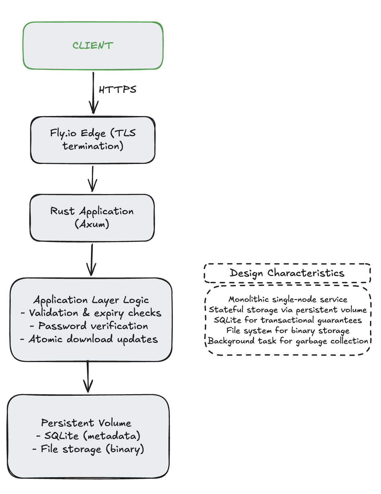

# Bear Share
bear_share is a single-node, production-deployable file sharing system designed to explore backend architecture, concurrency control, file lifecycle management, and transactional consistency in a real-world environment.

## In essence
The system allows users to:
1. Upload files
2. Protect files with a password
3. Set expiry rules (time-based or download-count based)
4. Share a link for controlled access

Files are automatically invalidated and eventually removed from storage when expiration conditions are met.

The core problems we intend to solve are:
- Consistent state between metadata and file storage
- Race-condition safe download counting
- Secure password handling
- Safe cleanup without breaking correctness

or to put it simply
```
User 1: | Upload | -> | set expiry and password | -> | generate a shareale link |
User 2: | Acess link | -> | enter correct pass | -> | download file |

some other periphery steps / functions:
- password validation
- file expiraion
- file size validation
```

## System Architecture


## Storage Architecture
*Metadata (SQLite)*
Each uploaded file is represented by a metadata row:
- UUID identifier
- Original filename
- Storage path
- Password hash (Argon2)
- Expiry timestamp
- Download limit
- Download counter
- Creation timestamp

SQLite is used because:
- It provides transactional safety.
- It avoids external infrastructure.
- It fits the single-node constraint.

