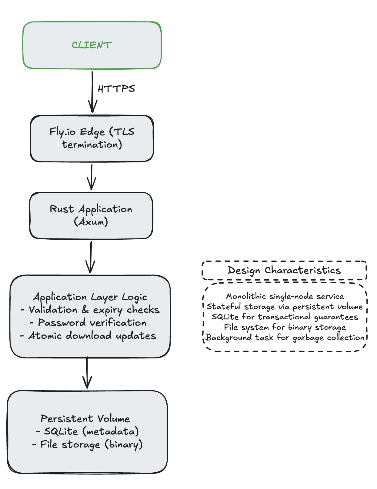

# BearShare 🐻

Hey there! Welcome to **BearShare** — a fast, secure, and ephemeral file-sharing system. 

At first glance, it looks like a sleek web app to send files to your friends, but under the hood, this is a **Systems Engineering project**. I built this to dive deep into backend architecture, concurrency control, safe memory management, and transactional consistency in a real-world environment.

## 🛠️ What's Actually Going On Here?

When you upload a file, there's a lot of heavy lifting happening behind the scenes to make sure things are fast, safe, and thread-secure.

### The Stack:
*   **Backend:** Rust 🦀, powered by the `axum` framework and `tokio` for heavy asynchronous I/O.
*   **Database:** `sqlx` driving a local **SQLite** database.
*   **Frontend:** A sharp, custom-built Next.js (React) interface using Tailwind CSS.
*   **Deployment:** Dockerized and built to survive elegantly in ephemeral cloud environments.

### Systems Concepts Explored:
1.  **Asynchronous I/O & Streaming:** Instead of loading a massive 2GB file directly into RAM (which would immediately crash the server), the Rust backend uses asynchronous streams to seamlessly pipe data chunks directly from the HTTP request into the server's filesystem.
2.  **Concurrency & Race Conditions:** What happens when 50 people try to download a file with a `max_download` limit of 1 at the exact same millisecond? The SQLite transactions handle race-condition-safe atomic download counting under high concurrency.
3.  **Data Lifecycle & Background Workers:** Files aren't meant to live forever here. BearShare runs an isolated asynchronous background worker (`tokio::spawn`) that continuously sweeps the database to clean up metadata and completely wipe physical files off the disk once they expire.
4.  **Security & Cryptography:** Passwords aren't stored in plain text. We use **Argon2** (with random salts) to compute memory-intensive cryptographic hashes, mathematically ensuring brute-force attacks are computationally exhausting.

## 🚀 How it Works (The User Journey)

Here is the simple, transient lifecycle of a file:

```text
User 1: → Drop File → Set Password & Self-Destruct Timers → Get Shareable Link
User 2: → Open Link → Enter Password                      → Download Safely
```

## 🏗️ Architecture



### Why SQLite?
When building distributed systems, developers almost reflexively reach for Postgres or Redis. But for a single-node architecture constraint, SQLite is practically a superpower. 
*   **Transactional Safety:** It is strictly ACID-compliant out of the box.
*   **Zero Infrastructure:** No external network hops, connection limits, or complex setups.
*   **Portability:** The entire state of the system is just a single file on disk!

## 💻 Getting Started Locally

Want to spin this up yourself and look at the code?

### 1. Run the Rust Backend
```bash
# From the root directory, simply run:
cargo run

# The server will automatically initialize the database schema and storage directories!
```

### 2. Run the Next.js Frontend
```bash
# Navigate to the frontend workspace
cd bear_share_frontend

# Install dependencies
npm install

# Start the dev server
npm run dev
```

Then just open `http://localhost:3000` in your browser and start securely transferring files!

---

*Built to explore how systems tick under the hood. Enjoy!*
